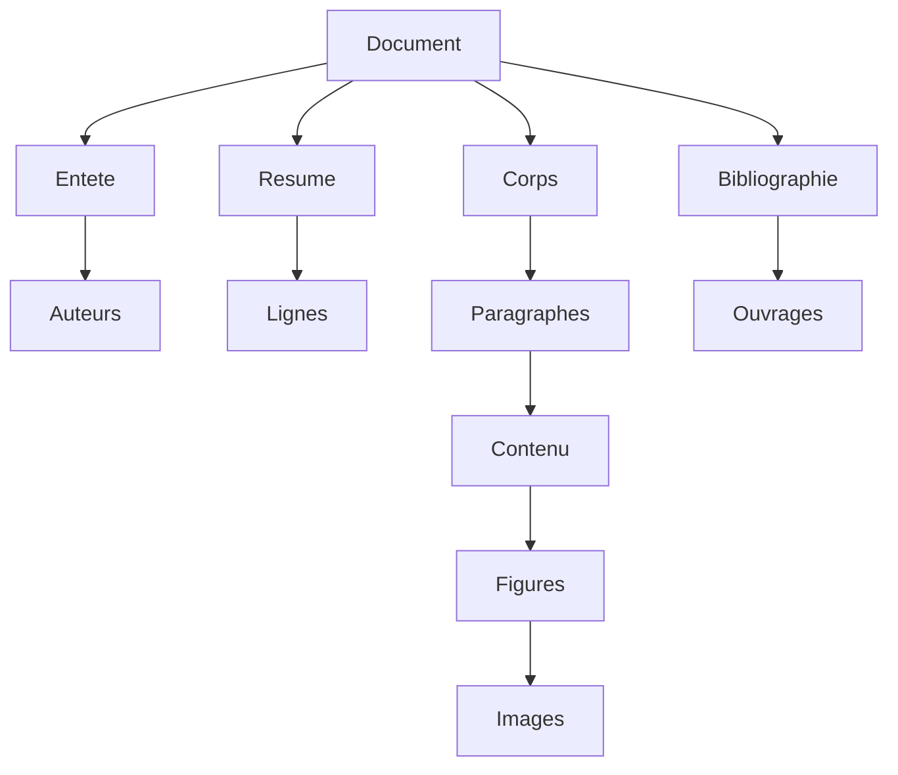

# 🧠 Projet SQL Oracle – Modélisation Orientée Objet d’un Document Scientifique

## 📋 Description du projet

Ce projet vise à créer une base de données **orientée objet sous Oracle SQL** pour la structuration complète d’un document scientifique (rapport, mémoire, thèse).

Il utilise les **types objets** et **collections TABLE OF** pour modéliser les composantes d’un document :

- 📝 Entête (titre, auteurs, date, mots-clés)
- 📄 Résumé structuré
- 📚 Corps principal avec paragraphes, sous-paragraphes, figures
- 📖 Références bibliographiques
- 💾 Insertion & interrogation de données

---

## 🛠️ Technologies utilisées

- Oracle SQL (Types objets, TABLE OF, INSERT, SELECT)
- SQL Worksheet / Oracle SQL Developer
- SGBD Oracle 21c+

---

## 🧱 Structure conceptuelle (simplifiée)


Extrait de code SQL (types objets)
```sql
-- Type Auteurs
CREATE TYPE t_auteurs AS OBJECT (
    nom_auteurs VARCHAR(50),
    affiliation VARCHAR(50)
);
CREATE TYPE Suiteauteurs AS TABLE OF t_auteurs;

-- Type Entête
CREATE TYPE t_entete AS OBJECT (
    titre_ent VARCHAR(50),
    auteurs Suiteauteurs,
    mots_cles VARCHAR(50),
    date_creation DATE
);

-- Type Image
CREATE TYPE t_image AS OBJECT (
    image_type BLOB,
    type_image VARCHAR(50)
);

-- Type Figures
CREATE TYPE t_figures AS OBJECT (
    numero_fig VARCHAR(50),
    titre_fig VARCHAR(50),
    image t_image,
    legende VARCHAR(50),
    description VARCHAR(250),
    sous_paragraphe Suiteparagraphes
);
CREATE TYPE Suitefigures AS TABLE OF t_figures;

-- Type Paragraphes
CREATE TYPE t_contenu AS OBJECT (
    texte_contenu t_figures,
    sous_paragraphe Suiteparagraphes
);
CREATE TYPE Suitecontenu AS TABLE OF t_contenu;

CREATE TYPE t_paragraphes AS OBJECT (
    numero_par VARCHAR(50),
    titre_par VARCHAR(50),
    contenu Suitecontenu
);
CREATE TYPE Suiteparagraphes AS TABLE OF t_paragraphes;

-- Type Corps
CREATE TYPE t_corps AS OBJECT (
    paragraphes Suiteparagraphes
);

-- Type Bibliographie
CREATE TYPE t_ouvrages_ref AS OBJECT (
    nom_auteur Suiteauteurs,
    titre_ouv VARCHAR(50),
    dates_par DATE,
    lieu_parution VARCHAR(50),
    documents_ouv t_document
);
CREATE TYPE Suiteouvrages_ref AS TABLE OF t_ouvrages_ref;

CREATE TYPE t_bibliographie AS OBJECT (
    ref_ouvrages Suiteouvrages_ref
);

-- Type Document principal
CREATE TYPE t_document AS OBJECT (
    type VARCHAR(50),
    nom VARCHAR(50),
    entete t_entete,
    resume t_resume,
    corps_doc t_corps,
    bibliographie t_bibliographie
);
```


📌 Requête d'exemple
-- Rechercher les documents contenant un mot-clé ou une référence à un auteur donné
```sql
SELECT d.nom
FROM documents d,
     TABLE(d.bibliographie.ref_ouvrages) r,
     TABLE(r.nom_auteur) a
WHERE a.nom_auteurs = 'Nom Auteur Recherché'
   OR d.entete.mots_cles = 'Mot Clé Recherché';
